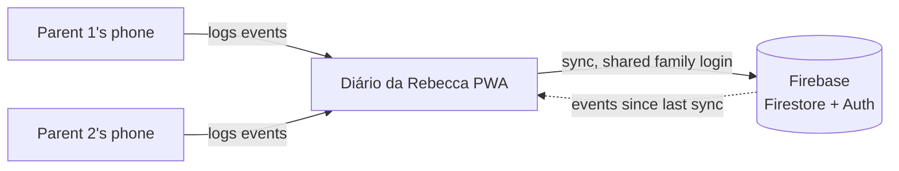
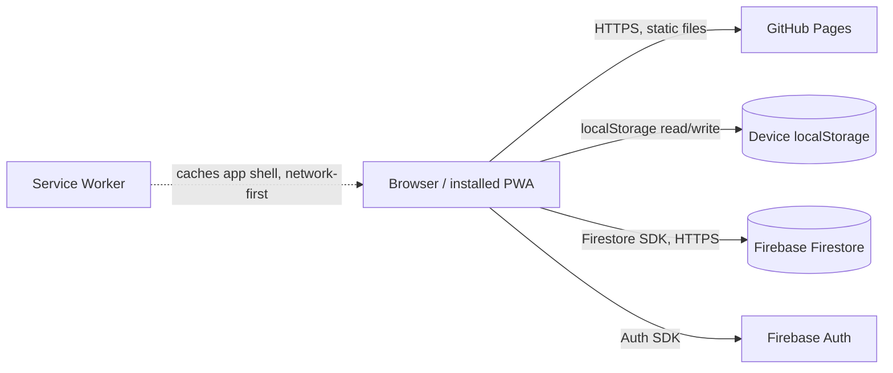
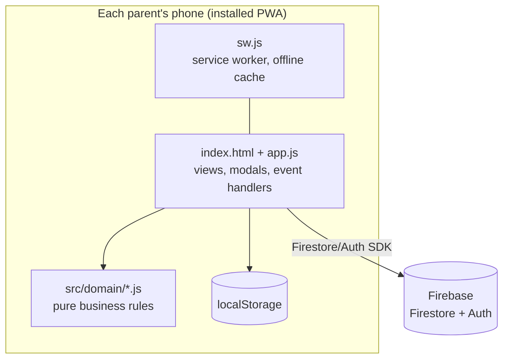
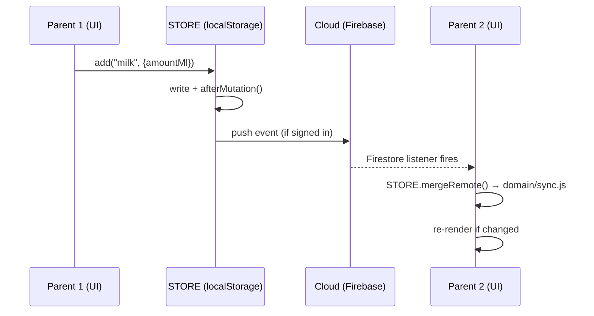

# Architecture: Diário da Rebecca

**Document Version:** 1.0
**Date:** 2026-07-09
**Status:** Living document (app already in production use)
**Architecture Framework:** arc42 (simplified)

<!-- DOC_KIND: explanation -->
<!-- DOC_ROLE: canonical -->
<!-- READ_WHEN: Read when you need the system model, boundaries, runtime flow, or design rationale. -->
<!-- SKIP_WHEN: Skip when you only need operational steps or API/database lookup details. -->
<!-- PRIMARY_SOURCES: docs/project/requirements.md, docs/project/tech_stack.md, ../../CLAUDE.md -->

<!-- SCOPE: System architecture (arc42 structure), diagrams, runtime scenarios, crosscutting concepts ONLY. -->
<!-- DO NOT add here: Tech stack versions → tech_stack.md, Requirements → requirements.md, Command reference/code layout for agents → ../../CLAUDE.md (this doc cross-links there instead of duplicating) -->

<!-- NO_CODE_EXAMPLES: This document describes decisions and structure, not implementations. For exact code, follow the file references. -->

## Quick Navigation

- [Docs Hub](../README.md)
- [Requirements](requirements.md)
- [Tech Stack](tech_stack.md)
- [CLAUDE.md](../../CLAUDE.md) (code layout, commands, per-module detail for AI agents)

## Agent Entry

| Signal | Value |
|--------|-------|
| Purpose | Explains system structure, boundaries, runtime behavior, and architectural decisions. |
| Read When | You need mental models, component boundaries, or cross-cutting concerns. |
| Skip When | You only need endpoint lists, schema lookup, or deployment commands. |
| Canonical | Yes |
| Next Docs | [Requirements](requirements.md), [Tech Stack](tech_stack.md), [CLAUDE.md](../../CLAUDE.md) |
| Primary Sources | `docs/project/requirements.md`, `docs/project/tech_stack.md`, `../../CLAUDE.md` |

---

## 1. Introduction and Goals

### 1.1 Requirements Overview
See [Requirements](requirements.md) for the full list. The core loop: log an event in one tap →
see it reflected in today's summary, the calendar, and trend charts → optionally have it show up
on the other parent's phone within seconds via Firebase sync.

### 1.2 Quality Goals
1. **Reliability of the core loop** — logging an event must never lose data, even offline.
2. **Low operational cost** — free-tier hosting (GitHub Pages) and free-tier backend (Firebase Spark).
3. **Low migration cost** — business rules (sleep intervals, reminder logic, trends, sync merge) stay portable to a future UI rewrite (see Section 4).
4. **Accessibility** — WCAG AA: ≥44px touch targets, AA contrast, visible focus states (see [Requirements §3](requirements.md)).

### 1.3 Stakeholders
The two parents (users and only stakeholders today). No external team, no SLA.

---

## 2. Constraints

### 2.1 Technical Constraints
- No bundler in the production deploy path (GitHub Pages serves `main` as static files) — see [ADR: no-build deploy](#41-technology-decisions).
- Firebase Spark (free) tier — no server-side code beyond Firestore rules today.
- Must run installed as a PWA on Android (Chrome) and iOS (Safari 16.4+, "Add to Home Screen").

### 2.2 Organizational Constraints
Two-person personal project. No sprints, no formal release process — changes ship by pushing to
`main`, which GitHub Pages serves immediately.

### 2.3 Conventions
ESLint (flat config) + Prettier, enforced via a Husky pre-commit hook (lint-staged + `npm test`)
and a GitHub Actions quality gate on push/PR to `main`. See [Tech Stack §4](tech_stack.md).

---

## 3. Context and Scope

### 3.1 Business Context
Two parents use the app on their own phones. It has one external dependency for its optional
sync feature: Firebase (Firestore + Auth).

**Business Context Diagram:**

### 3.2 Technical Context

---

## 4. Solution Strategy

### 4.1 Technology Decisions

| Layer | Technology | Rationale |
|-------|------------|-----------|
| UI | Vanilla HTML/CSS/JS, native ES modules | No framework overhead for the current feature set; avoids a migration no one asked for yet |
| Deploy | GitHub Pages serving `main` directly | Zero build/deploy pipeline to maintain; free |
| Domain logic | `src/domain/*.js`, framework-agnostic | Portable to a future rewrite without re-deriving business rules |
| Persistence (local) | `localStorage` via a `STORE` abstraction in `app.js` | Offline-first by default, no server required to use the app at all |
| Persistence (sync) | Firebase Firestore + Auth | Free tier covers a family's usage; managed offline persistence and realtime sync out of the box |
| Dev tooling | Vite/Vitest, ESLint, Prettier, Husky | Dev/test-only — never shipped to production (see [Tech Stack](tech_stack.md)) |

### 4.2 Top-Level Decomposition
Three layers inside the single `app.js` + `src/domain/` codebase:
1. **Domain** (`src/domain/*.js`) — pure functions, no DOM, unit-tested with Vitest.
2. **Data** (`STORE` object in `app.js`, plus the `Cloud` object for Firebase) — CRUD + sync merge.
3. **UI** (the rest of `app.js`) — view rendering, modals, event wiring.

Rationale: a future UI rewrite (e.g., React) only replaces layer 3; layers 1–2's contracts stay
stable. See `../../CLAUDE.md` for the exact module list and the one currently-known inconsistency
in the trends module.

### 4.3 Approach to Quality Goals

| Quality Goal | Approach |
|---------------|----------|
| Reliability | `localStorage` is the source of truth even when offline; Firestore offline persistence queues writes until reconnect; last-write-wins + tombstone deletes avoid silent data loss on merge |
| Low cost | Firebase Spark tier, GitHub Pages, no paid infra anywhere in the stack |
| Low migration cost | Domain/UI split (Section 4.2); domain modules have no DOM or Firebase dependency |
| Accessibility | Manual WCAG AA pass already applied (contrast, touch targets, focus states, grid alignment) |

---

## 5. Building Block View

### 5.1 System Context (C4 Level 1)
Same as [Section 3.1](#31-business-context) — a single PWA used by two parents, syncing through Firebase.

### 5.2 Container View (C4 Level 2)

There is no backend server container — Firebase is the only remote system, and GitHub Pages is a
static file host, not an application server.

### 5.3 Component View — inside `app.js` (C4 Level 3)

| Component | Responsibility | Depends on |
|-----------|-----------------|------------|
| `STORE` | localStorage CRUD, tombstone deletes, delegates conflict merge | `src/domain/sync.js` |
| `Cloud` | Firebase Auth sign-in/up, Firestore listeners, pushes local changes, calls `STORE.mergeRemote` | Firebase SDK, `STORE` |
| Event editor / modals (milk, food, event, appointment) | Create/edit/delete a single event via the UI | `STORE` |
| Calendar / day log renderers | Render month grid and per-day timeline | `STORE`, `src/domain/summary.js` |
| Trends renderer | Render the 7 bar charts for a date range | `src/domain/trends.js` |
| Reminder banner | Show/hide the 3h milk reminder | `src/domain/reminder.js` |
| `src/domain/*.js` | Pure rules: day-key/duration math, day summaries, reminder/night-sleep logic, trend series, sync merge | none (no DOM, no Firebase) |

See `../../CLAUDE.md` for the exact top-to-bottom layout of `app.js` and the one known
inconsistency (a legacy local `seriesForRange` duplicate) still to be reconciled.

---

## 6. Runtime View

### 6.1 Scenario: Log a milk event, then sync to the other phone
1. Parent taps "Comeu — Leite" → milk modal opens, amount entered → `STORE.add("milk", {amountMl})`.
2. `STORE` writes the event to `localStorage` with a fresh `updatedAt`, then calls `afterMutation()` to re-render today's summary, calendar, and reminder state.
3. If signed in, `Cloud` pushes the new event to `accounts/{uid}/events/{id}` in Firestore.
4. The other phone's Firestore listener fires, calls `STORE.mergeRemote(remote)`, which delegates to `src/domain/sync.js`'s pure `mergeRemote` (last-write-wins by `updatedAt`) and re-renders if anything changed.

### 6.2 Scenario: Milk reminder suppressed by night sleep
1. Every render tick, `refreshReminder()` calls `milkReminderState(STORE.babyEvents())` (`src/domain/reminder.js`).
2. That function checks `isNightSleeping(...)`: if the most recent sleep-related event is an open `night_start` (no matching wake yet, within a 16h cap), the reminder is suppressed regardless of how long it's been since the last milk event.
3. A nap (`nap_start`/`nap_end`) does **not** suppress the reminder — only night sleep does.
4. If not night-sleeping and 3h+ have passed since the last milk event, the reminder banner is shown.

This rule is covered by `test/domain/reminder.test.js` (9 cases, including edge cases around the
16h cap and midnight-crossing sleep).

---

## 7. Crosscutting Concepts

### 7.1 Security Concept
- Auth: Firebase Auth, email/password, one shared family account (not per-user).
- Authorization: Firestore security rules restrict each account's subtree to its own `uid` — see `FIREBASE-SETUP.md` for the exact rule. This is the actual security boundary, not the Firebase Web API key (which is public-by-design for Firebase web apps).
- No secrets are stored in this repo beyond that public Web API key; see the secret-scan note in [Tech Stack §4](tech_stack.md).

### 7.2 Error Handling Concept
Lightweight by design (personal-use scale): `try/catch` around Firebase calls surfaces failures as
a `toast()` message; there's no structured logging/telemetry, since there's no ops team to consume it.

### 7.3 Configuration Management Concept
`firebase-config.js` holds the Firebase Web SDK config (`window.FIREBASE_CONFIG`). If `apiKey` is
empty, sync silently disables and the app works fully local — this is the only environment "switch"
in the app.

### 7.4 Data Access Pattern
`STORE` is a simple CRUD object over `localStorage`, not a generic repository abstraction — there's
exactly one local data source and one remote one (`Cloud`), and no ORM/query layer is needed at
this scale.

---

## 8. Architecture Decisions (ADRs)

No formal ADR records exist yet (`docs/reference/adrs/` is empty) — the project is small enough
that key decisions are captured directly in this document (Section 4) and in
[Requirements §6](requirements.md#6-assumptions-and-dependencies). Create an ADR here if a future
decision (e.g., the actual migration trigger from Section 4) needs a durable, dated record.

---

## 9. Quality Requirements

### 9.1 Quality Scenarios

| ID | Goal | Scenario | Expected Response |
|----|------|----------|--------------------|
| QS-1 | Reliability | Device goes offline mid-log | Event still saves to `localStorage`; syncs once back online |
| QS-2 | Reliability | Both parents edit/delete the same event while offline from each other | Last-write-wins by `updatedAt`; deletion propagates as a tombstone, not silently reappearing |
| QS-3 | Accessibility | User navigates by keyboard/screen reader | All interactive elements have visible focus states and ≥44px touch targets |
| QS-4 | Low migration cost | A future rewrite replaces the UI layer | `src/domain/*.js` needs zero changes; only `app.js`'s UI section is rewritten |

---

## 10. Risks and Technical Debt

| Item | Risk | Mitigation | Status |
|------|------|------------|--------|
| Legacy local `seriesForRange`/trends duplication mentioned in `../../CLAUDE.md` | Confusing which definition is live if touched carelessly | Documented in `CLAUDE.md`; reconcile next time trends code is touched | Open |
| `build.ps1` inlining `app.js` into `DiarioDoBebe.html` doesn't account for ES `import` statements | The single-file offline artifact is currently stale/likely broken if regenerated | Documented in `CLAUDE.md`; decide whether to fix or retire this artifact | Open |
| No Web Push yet (FR-PSH-001) | Reminders don't fire with the app fully closed | Planned: FCM Web Push + a scheduling Cloud Function (requires Firebase Blaze) | Planned |

---

## 11. Glossary

| Term | Definition |
|------|------------|
| Tombstone | A logically-deleted event (`deleted: true`) kept in storage so the deletion itself propagates through sync, instead of just disappearing locally |
| Last-write-wins | Conflict resolution strategy: the event with the newer `updatedAt` wins on merge |
| Domain module | A pure, DOM-free, framework-agnostic JS module under `src/domain/`, covered by Vitest |
| PWA | Progressive Web App — installable, offline-capable web app |

---

## Maintenance

**Last Updated:** 2026-07-09

**Update Triggers:**
- A new container or external system is added (update Section 3/5 diagrams)
- The domain/UI split changes, or a new `src/domain/` module is added
- A risk in Section 10 is resolved or a new one is discovered
- A migration trigger from Section 4 is hit and a decision is made (add an ADR)

**Verification:**
- [ ] Diagrams match the current code structure
- [ ] Section 10 risks match `../../CLAUDE.md`'s "known inconsistency" notes
- [ ] No component described here has been removed from the codebase
